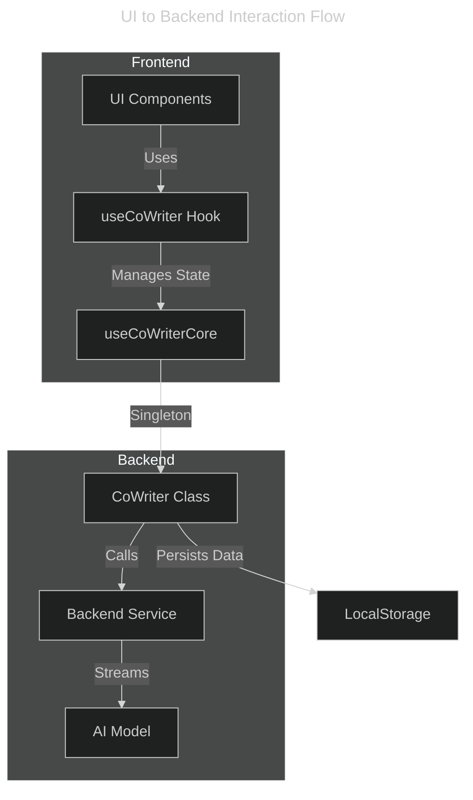

This diagram shows how the React UI components interact with the CoWriter backend system:

## Key Interactions:
1. **UI Components** (HomePage, MarkdownCell, ChatPanel, ...):
   - Handle user interactions
   - Trigger state changes through hooks

2. **useCoWriter Hook**:
   - Manages editing state
   - Handles TTS functionality
   - Coordinates with core logic

3. **useCoWriterCore**:
   - Interfaces with singleton CoWriter instance
   - Manages state subscriptions

4. **CoWriter Class**:
   - Central business logic
   - Handles message processing
   - Manages notebook/cell operations
   - Persists data to localStorage

5. **Backend Service**:
   - Streams responses from AI models
   - Handles API communication

6. **AI Model**:
   - Processes prompts
   - Generates responses and proposed changes